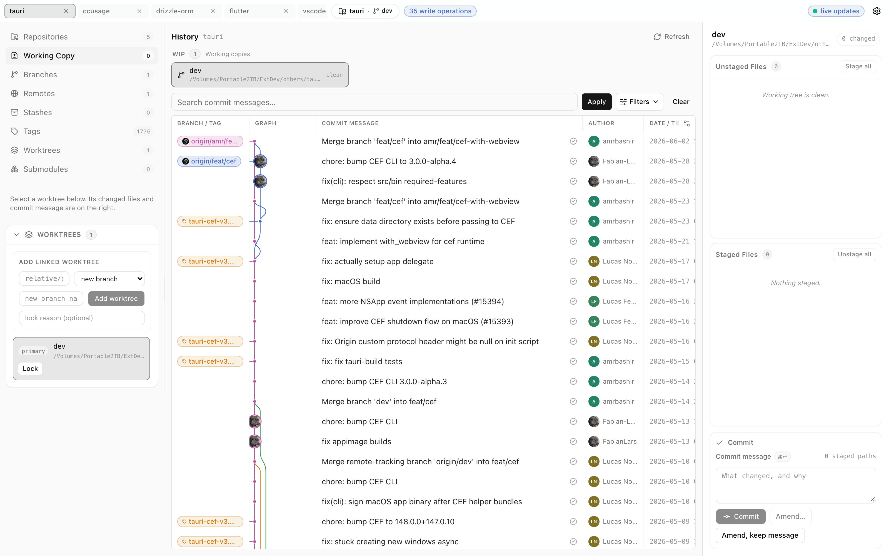
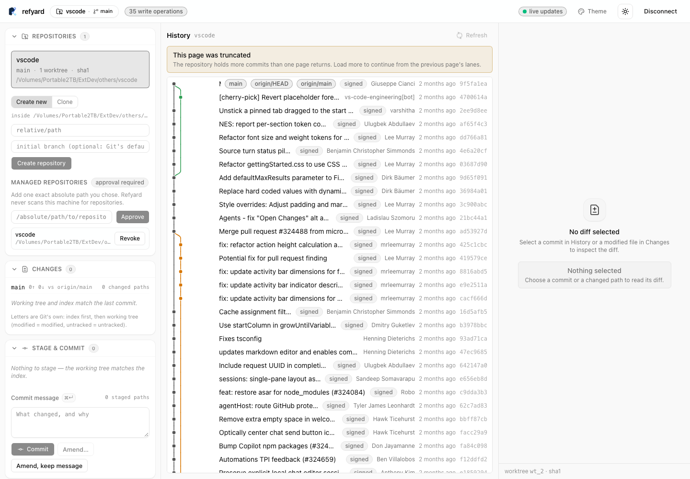

# Refyard

**A local-first Git workbench: the whole history of your repository in a beautiful graph,
without giving a hosted service your repository.**

[](https://www.npmjs.com/package/refyard)
[](https://www.npmjs.com/package/refyard)
[](https://github.com/HuakunShen/refyard/actions/workflows/ci.yml)
[](LICENSE)
[](https://deploy.workers.cloudflare.com/?url=https://github.com/HuakunShen/refyard)

<picture>
  <source media="(prefers-color-scheme: dark)" srcset="docs/assets/desktop-workbench-dark.png" />
  
</picture>

_A real local session reading a large open-source repository: the signed, braided history with
its parallel branch lanes, the working copy, and the panel rail — nothing mocked._

Refyard drives **your machine's own `git`** and never asks for a hosted copy of your code. Git
runs as you — with your hooks, filters, credential helpers, and SSH configuration — and the UI
receives a closed JSON contract plus authenticated SSE updates. One repository ships two
runtimes with the same UI and the same safety rules:

- **Native desktop app and CLI (Rust/Tauri 2)** — the headline form. A native macOS, Windows,
  and Linux application whose Git engine is Rust (`crates/`); the UI is compiled in and talks to
  the host over Tauri IPC, with no JavaScript runtime bundled (`pnpm native:verify` fails the
  build if one ever shows up). It opens local repositories and remote repositories over SSH, with
  hosts chosen from the machine's own `~/.ssh/config` — nothing is installed on the remote.
- **Node CLI (`refyard open|serve|doctor`)** — serves an authenticated loopback HTTP API and the
  static SvelteKit workbench from one local origin; the same UI is also deployable as a static
  PWA to Cloudflare (below).

Both runtimes speak one closed contract, rendered by one Svelte component library
([`packages/git-ui`](packages/git-ui)) — which is also what the VS Code extension embeds.

## What the workbench does

- **History** — commit graph with colored lanes, signed-commit badges, branch/remote/tag ref
  decorations, and commit search with filters.
- **Working copy** — stage and unstage files, commit, amend the last commit, with per-file diffs.
- **Panels** — Branches, Remotes, Stashes, Tags, Worktrees (add and lock linked worktrees), and
  Submodules.
- **Themes and settings** — dark, light, and system theme, plus accent and appearance options,
  in a Settings dialog.
- **Live updates** over SSE: the graph, status, and panels track the repository as it changes.

## Get it

Installers are published on [GitHub Releases](https://github.com/HuakunShen/refyard/releases/latest)
by the tag-triggered desktop pipeline:

| Platform              | Artifacts                       |
| --------------------- | ------------------------------- |
| macOS (Apple Silicon) | `Refyard_<version>_aarch64.dmg` |
| macOS (Intel)         | `Refyard_<version>_x64.dmg`     |
| Linux x64 and arm64   | `.deb` and `.AppImage`          |
| Windows x64           | NSIS installer (`.exe`)         |

Every artifact is minisign-signed, and each release carries a `latest.json` for the updater
(see [Updates](#updates)).

> **macOS without Apple code signing.** The binaries are ad-hoc signed only — there is no
> Apple Developer ID behind them yet — so Gatekeeper blocks the first launch of a copy
> downloaded from a browser. Clear the quarantine flag once, then open normally:
>
> ```sh
> xattr -cr /Applications/Refyard.app
> ```
>
> (or right-click the app and choose **Open** once, or approve it under **System Settings →
> Privacy & Security**). Installing through Homebrew is not affected — Homebrew does not
> quarantine casks.

Homebrew (macOS), once the first release is published. The cask is versioned off the release
DMG URLs, declares `auto_updates true` so the app's own updater stays in charge, and has a
livecheck watching the releases:

```sh
brew install --cask HuakunShen/tap/refyard
```

The cask's source of truth lives in
[`packaging/homebrew/Casks/refyard.rb`](packaging/homebrew/Casks/refyard.rb).

### Build from source

Development uses Node 26.x and pnpm 11:

```sh
pnpm install
pnpm check
pnpm test
pnpm build
```

Native desktop app and CLI (macOS arm64 is what the test suites cover):

```sh
pnpm desktop:build                        # Refyard.app under apps/desktop/src-tauri/target/release/bundle/macos
cargo build --release -p refyard-native   # native CLI at target/release/refyard-native
```

The native CLI mirrors the Node commands:

```sh
refyard-native doctor [--json]                 # what this machine can do; exit 2 when unusable
refyard-native open <path>...                  # the service plus the built workbench
refyard-native serve <path>... --json --no-open # API-only; readiness JSON on stdout, pairing URL on stderr
```

`--port` (default 9595; an explicitly requested busy port is refused), `--ticket-ttl`, `--json`,
and `--no-open` behave as in the Node CLI. `--machine` is the native pairing mode for
supervisors — readiness JSON on stdout, a single-use pairing URL on stderr — and is what the
VS Code extension drives.

Node CLI, from a checkout:

```sh
pnpm build:release    # bundles the CLI plus local SPA and stages packages/npm-dist
pnpm pack:smoke       # packs it, installs it into a temporary HOME, and uses it
```

After the npm release, the installed form is:

```sh
npx refyard /absolute/path/to/repository
# or, after a global install:
refyard open /absolute/path/to/repository
```

## VS Code extension

[`apps/refyard-vscode`](apps/refyard-vscode) (publisher `HuakunShen`) brings the same workbench
into VS Code for the repository you have open. It reuses the `@refyard/git-ui` Svelte components
inside a webview to show the working-copy status, the history graph, and diffs — read-only for
now; staging and commits land later.

The extension spawns the local `refyard-native` CLI in machine-pairing mode (`--machine`):
readiness JSON on stdout, a single-use pairing URL on stderr, and the ticket bound to the empty
origin so no browser can spend it. The webview never sees a token. Configuration is
`refyard.cliPath` (default `refyard-native` on PATH); commands are **Refyard: Open Workbench**
(`refyard.openWorkbench`), **Refyard: Refresh** (`refyard.refresh`), and **Refyard: Shutdown
Service** (`refyard.shutdown`). Build it as a `.vsix`:

```sh
pnpm --dir apps/refyard-vscode package   # compiles host + webview, then emits refyard-0.1.0.vsix
```



## Updates

The desktop app checks
`https://github.com/HuakunShen/refyard/releases/latest/download/latest.json` — only when you
ask it to. **Settings → Updates** has a manual **Check for updates** (it shows the available
version; **Install and restart** applies it), and an automatic check at startup that is
opt-in and defaults to **off**. Nothing is downloaded on its own.

Update packages are verified against the project's minisign public key, which ships inside the
app, so an unsigned feed is refused. The same feed backs the Homebrew cask's `auto_updates`
behaviour, so `brew upgrade` and the in-app updater never fight.

## The Node runtime and its loopback security model

`refyard open <path>` starts the complete local workbench for explicitly chosen repositories
and prints a single-use pairing URL in the terminal. `refyard serve --repo <path> --no-open
--json` is the API-only form for supervisors, integrations, and separately hosted UI;
`refyard doctor` reports what the machine can do.

- Loopback only. Default port 9595; if that is busy another free port is taken and named, an
  explicitly requested busy `--port` is refused, and `--port 0` asks the OS for one.
- Every HTTP call is authenticated — reads included. The terminal prints a single-use bootstrap
  ticket; the browser exchanges it for an in-memory bearer that is never placed in
  `localStorage`.
- Exact `Origin`/`Host` checks, no CORS wildcard, JSON 404 for unknown `/api` paths, no
  fallthrough to the SPA. Live updates arrive over authenticated SSE.
- Multiple repositories require repeated, explicit `--repo` arguments — Refyard never scans a
  parent directory.
- The browser sends Git _intentions_; only trusted core turns intentions into Git arguments. No
  raw `runGit(args, cwd)`, shell, `cwd`, or `env` crosses the HTTP or browser boundary.

## Deploy the UI to your own Cloudflare account

[](https://deploy.workers.cloudflare.com/?url=https://github.com/HuakunShen/refyard)

The button creates a Worker deployment in your Cloudflare account from this public repository.
It deploys the static PWA only; it does not move a repository or install the Node API. The same
flow is available from a checkout:

```sh
pnpm deploy
```

The Worker is an asset-only remote UI host: it has no Git binding, repository path, shell,
credential store, bearer token, or API proxy, and it never receives Git contents. The initial
`PUBLIC_API_ORIGINS` value is empty by design, so the browser cannot call an arbitrary backend
until the owner configures one. If you connect the UI to a remote machine, expose that
machine's loopback API through your own HTTPS tunnel, configure that exact origin in the
Worker, and start the CLI with matching `--allow-origin`, `--ui-origin`, and `--api-origin`
values plus the environment-only `REFYARD_HOSTED_PASSWORD`. There is no central Refyard relay.

## Release and trust

`ci.yml` is the test workflow. `publish.yml` is the only npm publisher and runs on `v*` tags
after the package build and smoke tests, using npm Trusted Publishing through GitHub OIDC with
`environment: publish` — no `NPM_TOKEN` or `NODE_AUTH_TOKEN` is needed. `release.yml` is the
only desktop publisher and runs on `app-v*` tags: the test contract gates first, then a
five-runner matrix (macOS Apple Silicon and Intel, Ubuntu x64 and arm64, Windows x64) builds,
signs, and publishes the artifacts and the updater's `latest.json` automatically. The two
release lines can never be confused.

The package and repository are licensed under the [GNU Affero General Public License v3.0
only](LICENSE) (AGPL-3.0-only). If you run a modified Refyard service for users over a network,
AGPLv3's corresponding-source requirements apply to that deployment.

## Safety boundary

- Repository roots are approved explicitly and kept separate.
- Destructive actions require confirmation, a backup where possible, and a verified precondition.
- A killed process records its in-flight operation as `unknown`; the repository's next write
  stays blocked until a person confirms the state in the app.
- Unknown Git outcomes are reported as unknown and are never retried automatically.
- The browser sends Git intentions; only trusted core creates Git arguments.
- The complete operation set is the one reported by `GET /api/v1/capabilities` — anything
  unimplemented is simply absent, never faked.

## Repository map

| Path                    | Responsibility                                                           |
| ----------------------- | ------------------------------------------------------------------------ |
| `apps/web`              | SvelteKit shell, static adapter, PWA, asset-only Worker                  |
| `apps/cli`              | CLI grammar, `doctor`, `open`/`serve` lifecycle                          |
| `apps/desktop`          | Tauri desktop shell over the same service; no JS runtime in the bundle   |
| `apps/refyard-vscode`   | VS Code extension: the same UI in a webview, driven by `refyard-native`  |
| `crates/refyard-core`   | Host-free Git planners, parsers, safety rules (Rust)                     |
| `crates/refyard-host`   | Service, journal, queue, local and SSH providers (Rust)                  |
| `crates/refyard-http`   | Native loopback HTTP entry with the same closed contract (Rust)          |
| `crates/refyard-cli`    | Native CLI: `doctor`, `serve`, `open` (Rust)                             |
| `packages/git-contract` | Public Zod schemas and JSON Schema                                       |
| `packages/git-core`     | Host-free bytes, parsers, planners, workflows (TypeScript)               |
| `packages/host-node`    | Processes, filesystem, registries, coordinator, HTTP host                |
| `packages/git-client`   | Browser/Node HTTP and SSE client                                         |
| `packages/git-ui`       | Reusable Svelte 5 components                                             |
| `packages/npm-dist`     | Self-contained CLI + local-workbench publication staging                 |
| `tests`                 | Contract, core, integration, security, browser, compatibility, packaging |
| `docs`                  | Product decisions, plans, goals, evidence, release instructions          |

More detail lives in [`docs/installation.md`](docs/installation.md),
[`docs/releasing.md`](docs/releasing.md), and
[`docs/evidence/release-matrix.md`](docs/evidence/release-matrix.md).
